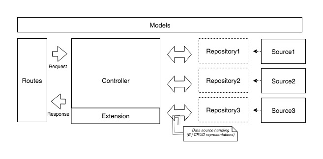

# Node.js API

This repository holds the source code of a **reference** for the development of a **Node.js api** written mainly in typescript.

## Before start ##

### Cascade explanation ###

Each module of the architecture contains a **guidelines&#46;md** file with specific explanation about the details of each module. *e.g. /http/controllers*.

## Architecture design

The reference uses a architecure based on [Uncle Bob Clean architecture](https://8thlight.com/blog/uncle-bob/2012/08/13/the-clean-architecture.html) and a Generic Model View Controller pattern.

### Overview 



### General description ### 

In general terms, the architecture uses the following structure:

  - /src: Business logic source.
  - /http: Http resources such as endpoints, controllers and websockets.
  - /assets: Project resources such as scripts, images and files.

### Business logic ###

  - /models: Store the system models, *e.g. Car, Agency, etc*. [Details](/src/models/guidelines.md)

  - /repositories: Represent the abstractions (interfaces) of system actions, e.g queries, transaction, etc. [Details](/src/repositories/guidelines.md)
    > Each repository is grouped by datasource, *e.g. sql, gmail, aws, etc.*

  - /sources: Are the implementations of the repository methods. [Details](/src/sources/guidelines.md)

 > In other words the repositories handle what is going to be done. *e.g. getPetList()* and the sources implement that action e.g. *query_to_database*

### Http resources ###

  - routes.ts & middlewares.ts: Handle the endpoints & middlewares **definitions**. [Details](/http/guidelines.md)

  - /controllers: Are the link between the business logic and http routes (GETs, SETs, PUTs). [Details](/http/controllers/guidelines.md)

    > It is the most important module of the architecture because it is the responsable of linking the data requirements (repositories), with the business logic (use cases).

  - /extensions: Are auxiliary classes of controllers in case of complex use cases *e.g Complex algorithms, AI, ML*.

  - /middlewares: Manage the handling of information before reaching the controllers. *e.g Validations & authentications*. [Details](/http/middlewares/guidelines.md)

### Assets ###
  - /dev: Resources related to the development of the project *e.g db.sql*.
  - /public: Resources that are publicly accessible *e.g profile_image.png, doc.pdf*.
<br/><br/>

### Configuration ###
  - app.ts: Handle server initialization and version managment of endpoints.
  - debug.ts: Temp file to debug source methods.
  - package.json & tsconfig.json: Handle the project configuration such as dependencies, paths and module definition.
  - .env.example & .env: Define the environment variables which are mainly used to store secret_keys.

### Class diagram


## Pre-requisites:

 * Download & install [Node js](https://nodejs.org/en/download/) or an equivalent.
 * Download & install [Visual Studio code](https://code.visualstudio.com/) or an equivalent (optional).

### To start coding and build:

 * Clone this repository.
 * Create a database instance with the db.sql scheme (See [scheme](./assets/dev/db.sql)).
 * Create an .env file with the project credentials based on *.env.example* file
 * Install dependencies.
 ```bash
 $ npm install
 ```
 * Install typescript.
 ```bash
 $ npm install -g typescript
 ```
 * Compile typescript (Optional).
 ```bash
 $ tsc
 ```
 * Run server.
 ```bash
 $ npm start
 ```

 ### To debug modules

 * Create an debug.ts file with based on *.deb.example* file
 * Modify debug.ts
 * Run script.
 ```bash
 $ npm run-scripts debug
 ```

 ### To generate documentation

 * Install apidoc.
 ```bash
 $ npm install apidoc -g
 ```
 * Generate docs.
 ```bash
 $ apidoc -i http/ -o docs/ -t assets/dev/docs_template/
 ```

  ### Examples *Pets CRUD*

 * Example docs.
 ```bash
 http://localhost:4004/docs
 ```
  * Example requests. 
 ```bash
 GET http://localhost:4004/v1/toys
 ```


